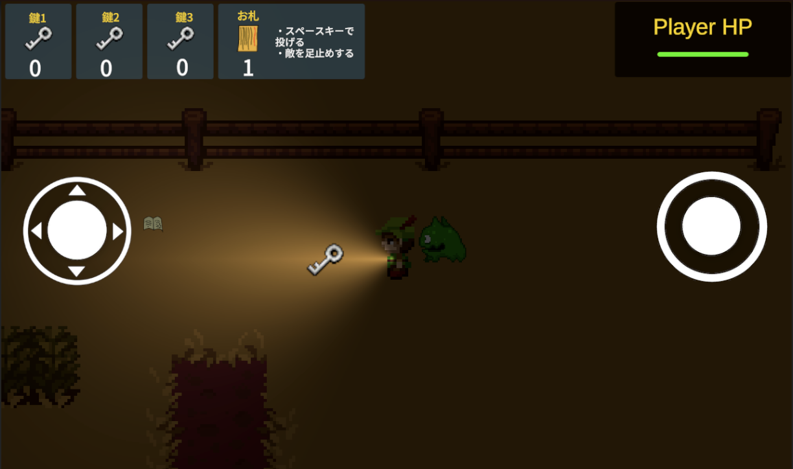

# Escape Darkness
## Escape Darknessについて
Escape Darkness は、暗闇の館を探索する 2DのRPG。
限られた視界の中で、鍵を見つけて該当するドアを開け、奥に潜むボスの間を目指します。
追跡してくる敵を避けながら、恐怖と緊張の中を生き延びましょう。

## ゲームプレイ方法
[ゲームのサンプルプレイはこちら]( https://arai1571.github.io/EscapeDarkness_web/)



=======

### 操作方法
* Eキー：次へ進む、落ちているノートを読む
* A/Dキー（← →キー）：左右に移動
* W/Sキー（↑ ↓キー）:上下に移動
* スペースキー：お札を飛ばす
  
### ゲームルール
* 敵やボスの攻撃を受けて HP が 0 になると ゲームオーバー。
* 敵は一定距離まで近づくとプレイヤーを追跡してくる。スピードはプレイヤーより遅いので、距離を取れば逃げ切れる。
* お札攻撃 により、敵を一定時間 足止め可能。
* ドリンクアイテムを拾うと HP が 1 回復（最大3）。
* 各部屋にはランダムに配置される 鍵とドア が存在。対応する鍵を見つけて進もう。
* 最奥には ボスルーム があり、5回お札の結界に引き入れると撃破。
* ボス直前の部屋では セーブポイント があり、何度でも挑戦可能。

## 使用技術
* ゲームエンジン：Unity
* 使用言語：C#
* 使用ツール：VisualStudioCode, Illustrator

## 開発の工夫
* 開発期間：18時間
* 担当範囲：企画〜アセットの導入、プログラミング、デバック仕上げ
* こだわった点：
  部屋生成・鍵配置をランダム化し、毎回異なる探索体験を実現
  暗闇表現とスポットライトでホラー感を演出
  シーン遷移時にプレイヤーの座標を正確に引き継ぐRoomManager設計
  
* 技術的な挑戦：
Playerの角度を変えると、子オブジェクトのSpotLightも向きをQuaternion.Eulerで変え、Quaternion.Slerpで滑らかに補正した。

### スクリプトの詳細
* PlayerController.cs
プレイヤーの移動・アニメーション・ダメージ処理を制御。
ダメージを受けた際は、Mathf.Sin を用いた点滅演出を実装。
被弾中は SpriteRenderer の enabled を切り替えて点滅させる。

```C#
// ダメージ中の点滅処理
if (inDamage)
{
    float val = Mathf.Sin(Time.time * 50);
    gameObject.GetComponent<SpriteRenderer>().enabled = val > 0;
    return;
}
```

* RoomManager.cs
各部屋の鍵・アイテム・ドアをランダムに配置し、
シーン遷移後も配置情報を再現する設計。
配列とフラグを用いて配置済みを管理し、
ダミードアを未使用スポットに自動生成。
```C#
// 重複しないランダム番号を抽選
do
{
    unique = true;
    rand = Random.Range(1, (itemSpots.Length + 1));
    foreach (int numbers in itemsPositionNumber)
    {
        if (numbers == rand) unique = false;
    }
} while (!unique);

// 設置済み以外のスポットにダミードアを生成
if (!match)
{
    Instantiate(dummyDoor, spots.transform.position, Quaternion.identity);
}
```

* GameManager.cs
ゲーム全体の状態管理・BGM制御・HP管理を統括。
シーン名を判定して自動的にBGMを切り替え、
playerHP を静的変数で保持することで
シーン間での HP 引き継ぎを実現。
```C#
// シーンに応じたBGM再生
switch (sceneName)
{
    case "Title": SoundManager.instance.PlayBgm(BGMType.Title); break;
    case "Boss": SoundManager.instance.PlayBgm(BGMType.InBoss); break;
    case "Opening":
    case "Ending": SoundManager.instance.StopBgm(); break;
    default: SoundManager.instance.PlayBgm(BGMType.InGame); break;
}
```

* BillData.cs / DrinkData.cs
アイテムを取得した際、GameManager に
状態を即時反映させる仕組みを採用。
配列 itemsPickedState[] にフラグを保存して
再ロード時のアイテム再配置を制御。
```C#
private void OnTriggerEnter2D(Collider2D collision)
{
    if (collision.gameObject.CompareTag("Player"))
    {
        GameManager.bill++;
        GameManager.itemsPickedState[itemNum] = true;
        Destroy(gameObject);
    }
}
```

* BossController.cs
一定間隔で弾を発射し、弾速・発射間隔を調整可能に設計。
HP が 0 になると GameState を gameclear に変更し、
エンディングへ遷移。
```C#
// 弾の発射
if (fireTimer >= fireInterval)
{
    GameObject bullet = Instantiate(bulletPrefab, firePoint.position, Quaternion.identity);
    bullet.GetComponent<Rigidbody2D>().velocity = dir.normalized * shootSpeed;
    fireTimer = 0f;
}
```

* ChangeScene.cs
ドアの OnTriggerEnter2D によって
シーンを自動で切り替えるトリガー制御。
直前のドア情報を RoomManager.toRoomNumber に保存し、
遷移先シーンでの正しいプレイヤー位置を再現。
```C#
private void OnTriggerEnter2D(Collider2D collision)
{
    if (collision.gameObject.CompareTag("Player"))
    {
        RoomManager.toRoomNumber = nextRoomName;
        SceneManager.LoadScene(sceneName);
    }
}
```
## 今後の展望
* 難易度や楽しさの調整（敵の種類を増やす・攻撃アイテムのバリエーションを増やす）
* ボイス・環境音の追加による没入感の強化
* 地図上を通過したら自動でマップが作成されていくマップの実装
* 複数エンディング分岐


